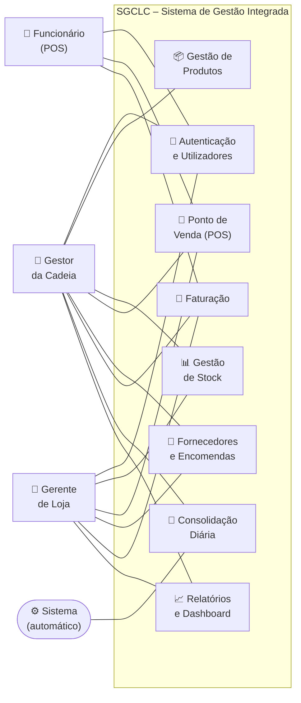
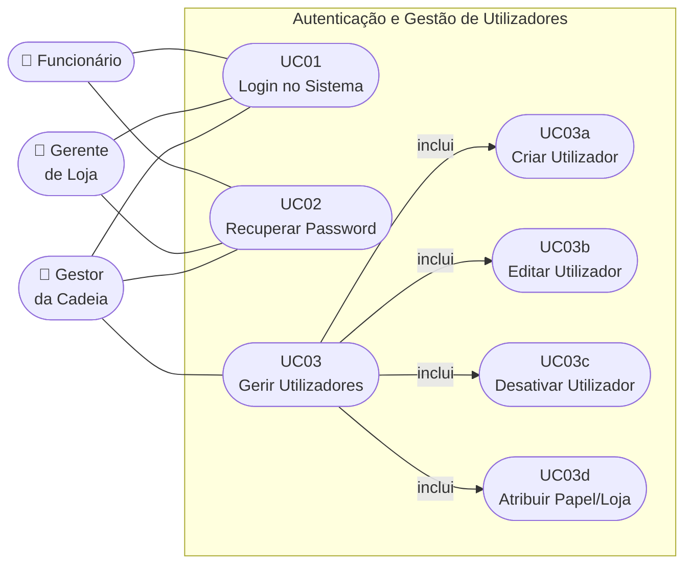
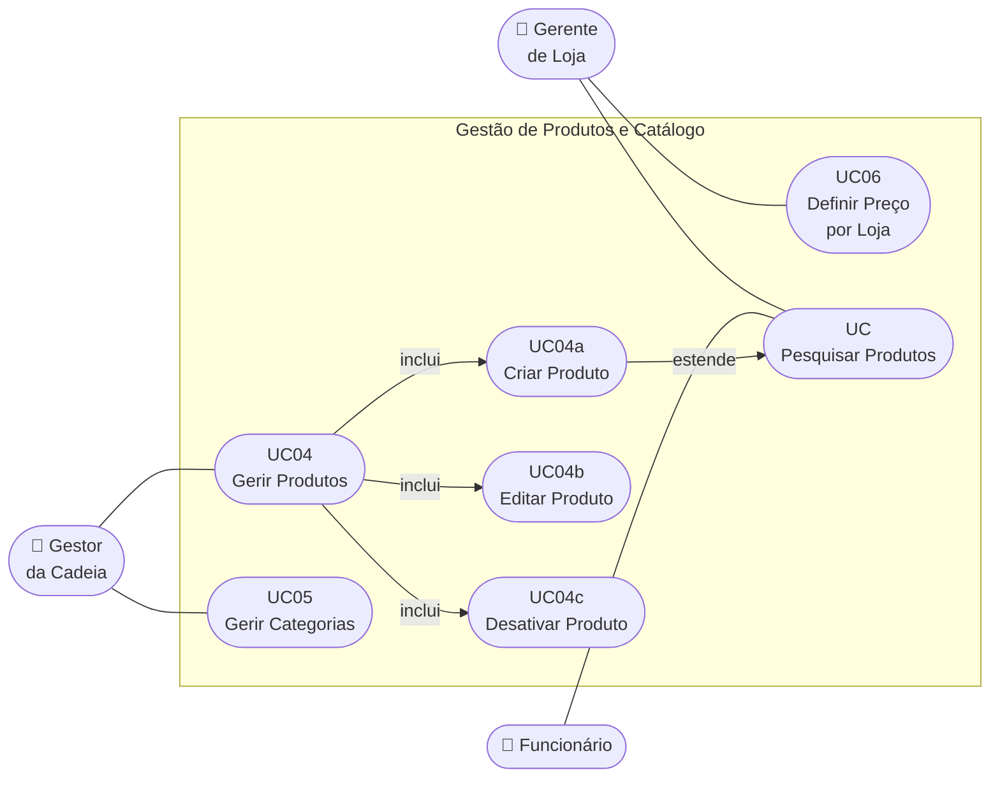
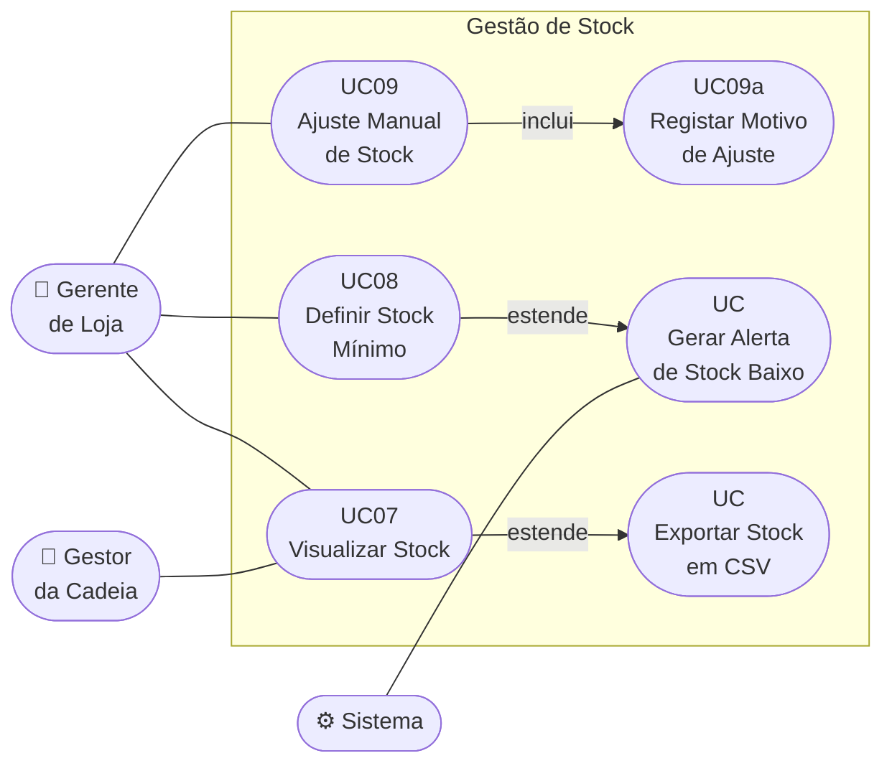
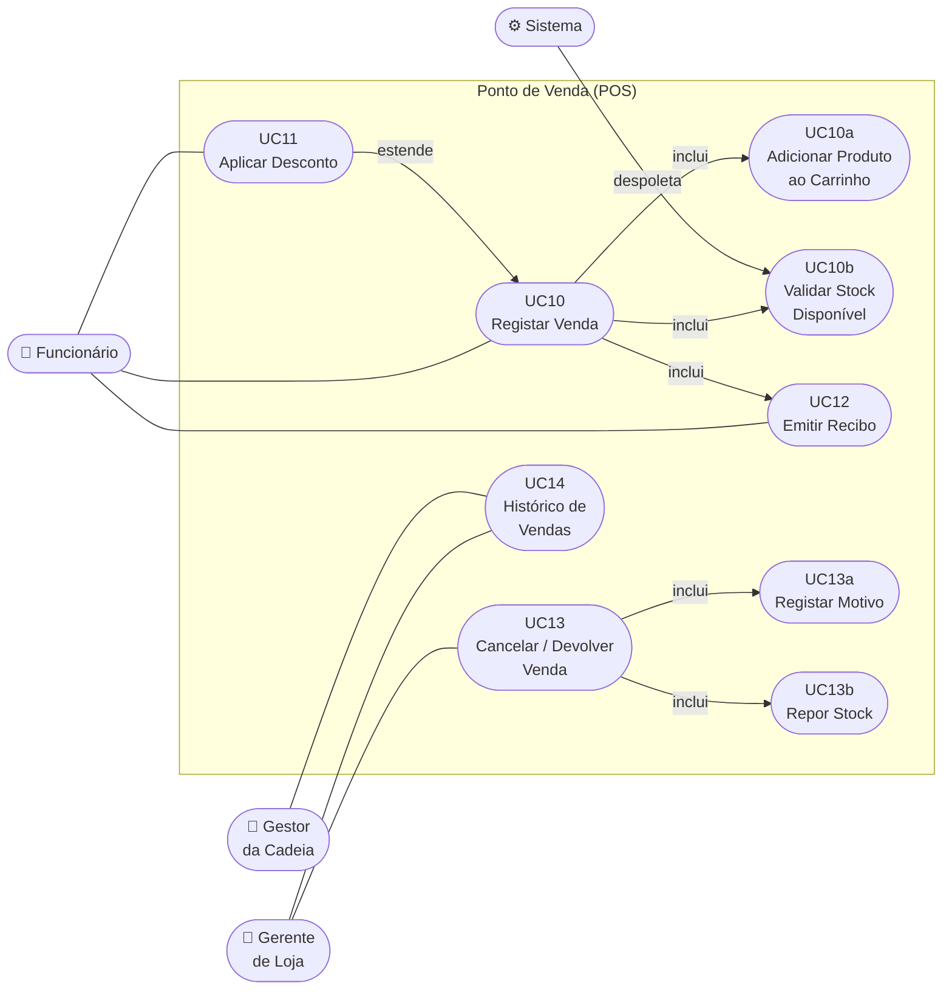
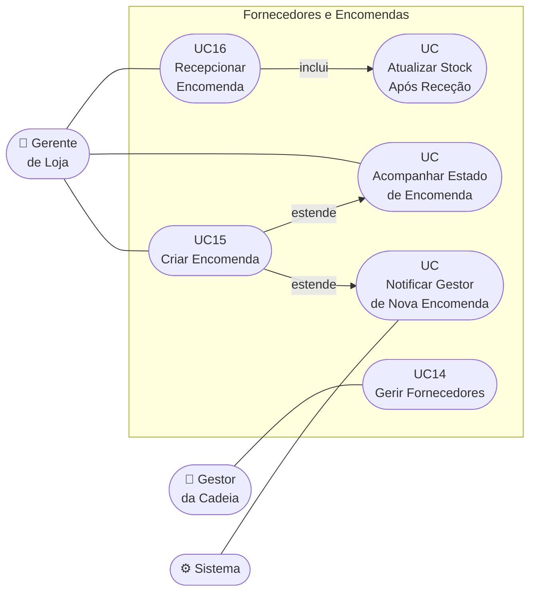
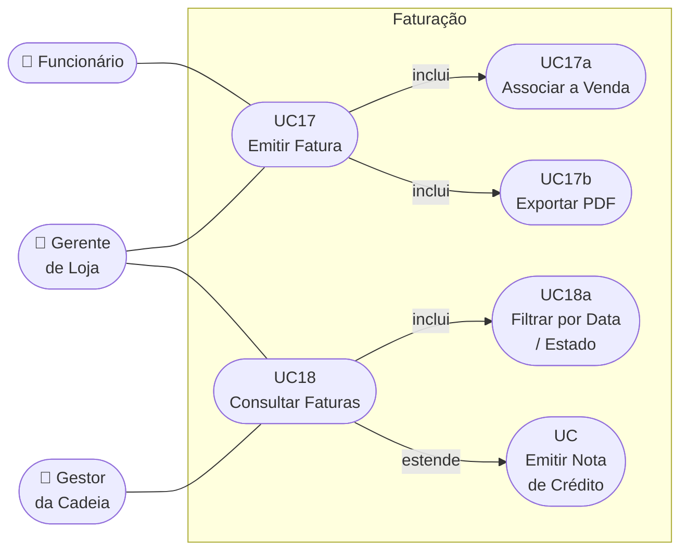
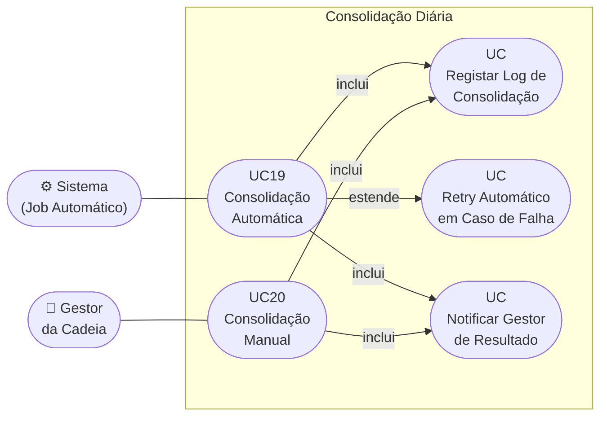
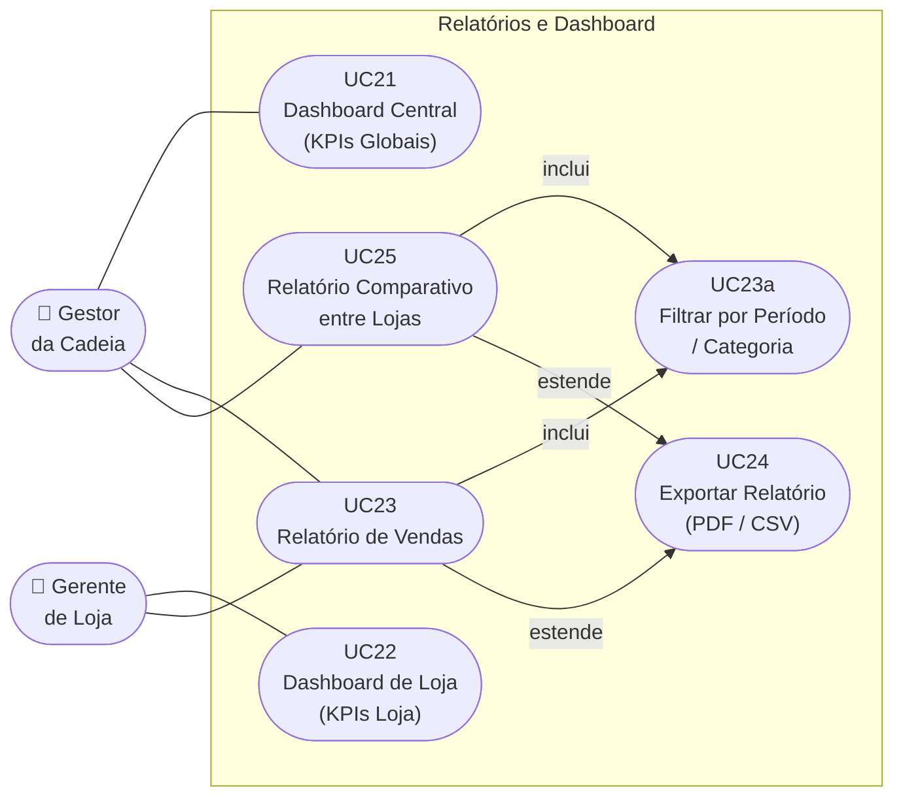

# Diagramas UML – Etapa 1
## Sistema de Gestão Integrada para uma Cadeia de Lojas de Conveniência (SGCLC)

**Versão:** 1.0 | **Data:** 24 de Fevereiro de 2026 | **Projeto:** LI4 2025/2026  
**Norma:** UML 2.5 (Use Case Diagrams)

> **Nota:** Esta etapa (Etapa 1) foca os **Diagramas de Casos de Uso** (Use Case Diagrams), que representam as interações entre atores e o sistema ao nível funcional. Os diagramas estruturais e comportamentais mais detalhados (Classes, Sequência, Componentes) são produzidos na Etapa 2.

---

## Índice

1. [Atores do Sistema](#1-atores-do-sistema)
2. [Diagrama Global de Casos de Uso](#2-diagrama-global-de-casos-de-uso)
3. [Diagrama 1 – Autenticação e Gestão de Utilizadores](#3-diagrama-1--autenticação-e-gestão-de-utilizadores)
4. [Diagrama 2 – Gestão de Produtos e Catálogo](#4-diagrama-2--gestão-de-produtos-e-catálogo)
5. [Diagrama 3 – Gestão de Stock](#5-diagrama-3--gestão-de-stock)
6. [Diagrama 4 – Ponto de Venda (POS)](#6-diagrama-4--ponto-de-venda-pos)
7. [Diagrama 5 – Gestão de Fornecedores e Encomendas](#7-diagrama-5--gestão-de-fornecedores-e-encomendas)
8. [Diagrama 6 – Faturação](#8-diagrama-6--faturação)
9. [Diagrama 7 – Consolidação Diária](#9-diagrama-7--consolidação-diária)
10. [Diagrama 8 – Relatórios e Dashboard](#10-diagrama-8--relatórios-e-dashboard)

---

## 1. Atores do Sistema

| Ator | Tipo | Descrição |
|---|---|---|
| **Gestor da Cadeia (GC)** | Primário | Administrador central com acesso total ao sistema |
| **Gerente de Loja (GL)** | Primário | Gere uma loja específica |
| **Funcionário (FN)** | Primário | Opera o POS da loja |
| **Sistema (SYS)** | Secundário | O próprio sistema SGCLC (para processos automáticos) |

---

## 2. Diagrama Global de Casos de Uso

Visão geral de todas as áreas funcionais e os atores que as utilizam:

---

## 3. Diagrama 1 – Autenticação e Gestão de Utilizadores

**RFs cobertos:** RF01, RF02, RF03, RF04, RF05

---

## 4. Diagrama 2 – Gestão de Produtos e Catálogo

**RFs cobertos:** RF06, RF07, RF08, RF09, RF10

---

## 5. Diagrama 3 – Gestão de Stock

**RFs cobertos:** RF11, RF12, RF13, RF14, RF15, RF16

---

## 6. Diagrama 4 – Ponto de Venda (POS)

**RFs cobertos:** RF17, RF18, RF19, RF20, RF21, RF22

---

## 7. Diagrama 5 – Gestão de Fornecedores e Encomendas

**RFs cobertos:** RF23, RF24, RF25, RF26, RF27

---

## 8. Diagrama 6 – Faturação

**RFs cobertos:** RF28, RF29, RF30, RF31, RF32

---

## 9. Diagrama 7 – Consolidação Diária

**RFs cobertos:** RF33, RF34, RF35, RF36

---

## 10. Diagrama 8 – Relatórios e Dashboard

**RFs cobertos:** RF37, RF38, RF39, RF40, RF41, RF42

---

## Resumo – Cobertura dos Diagramas

| Diagrama | Área Funcional | UCs | RFs |
|---|---|---|---|
| Diagrama 1 | Autenticação e Utilizadores | UC01–UC03 | RF01–RF05 |
| Diagrama 2 | Produtos e Catálogo | UC04–UC06 | RF06–RF10 |
| Diagrama 3 | Gestão de Stock | UC07–UC09 | RF11–RF16 |
| Diagrama 4 | Ponto de Venda (POS) | UC10–UC14 | RF17–RF22 |
| Diagrama 5 | Fornecedores e Encomendas | UC14–UC16 | RF23–RF27 |
| Diagrama 6 | Faturação | UC17–UC18 | RF28–RF32 |
| Diagrama 7 | Consolidação Diária | UC19–UC20 | RF33–RF36 |
| Diagrama 8 | Relatórios e Dashboard | UC21–UC25 | RF37–RF42 |
| **Total** | **8 áreas** | **25 UCs** | **42 RFs** |
