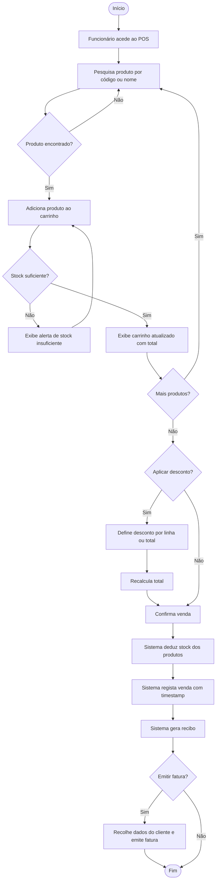
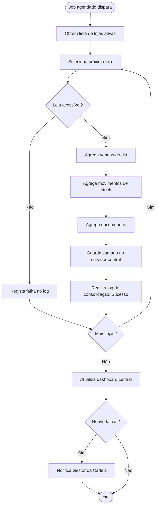
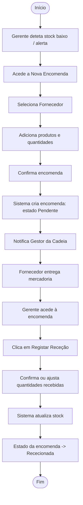

# Casos de Uso
## Sistema de Gestão Integrada para uma Cadeia de Lojas de Conveniência

**Versão:** 1.0 | **Data:** 24 de Fevereiro de 2026 | **Projeto:** LI4 2025/2026

---

## 1. Diagrama de Casos de Uso

```mermaid
%%{init: {'theme': 'default', 'themeVariables': {'fontSize': '14px'}}}%%
graph TD
    GC["👤 Gestor da Cadeia"]
    GL["👤 Gerente de Loja"]
    FN["👤 Funcionário"]

    subgraph SGCLC ["Sistema SGCLC"]

        subgraph auth ["Autenticação"]
            UC01["UC01 - Login"]
            UC02["UC02 - Recuperar Password"]
            UC03["UC03 - Gerir Utilizadores"]
        end

        subgraph produtos ["Produtos & Catálogo"]
            UC04["UC04 - Gerir Produtos"]
            UC05["UC05 - Gerir Categorias"]
            UC06["UC06 - Definir Preço por Loja"]
        end

        subgraph stock ["Gestão de Stock"]
            UC07["UC07 - Visualizar Stock"]
            UC08["UC08 - Definir Stock Mínimo"]
            UC09["UC09 - Ajuste Manual de Stock"]
        end

        subgraph pos ["Ponto de Venda"]
            UC10["UC10 - Registar Venda"]
            UC11["UC11 - Aplicar Desconto"]
            UC12["UC12 - Emitir Recibo"]
            UC13["UC13 - Cancelar/Devolver Venda"]
        end

        subgraph fornecedores ["Fornecedores & Encomendas"]
            UC14["UC14 - Gerir Fornecedores"]
            UC15["UC15 - Criar Encomenda"]
            UC16["UC16 - Recepcionar Encomenda"]
        end

        subgraph faturacao ["Faturação"]
            UC17["UC17 - Emitir Fatura"]
            UC18["UC18 - Consultar Faturas"]
        end

        subgraph consolidacao ["Consolidação"]
            UC19["UC19 - Consolidação Automática"]
            UC20["UC20 - Consolidação Manual"]
        end

        subgraph relatorios ["Relatórios & Dashboard"]
            UC21["UC21 - Dashboard Central"]
            UC22["UC22 - Dashboard de Loja"]
            UC23["UC23 - Relatório de Vendas"]
            UC24["UC24 - Relatório por Categoria"]
            UC25["UC25 - Relatório Comparativo Lojas"]
        end
    end

    GC --> UC01
    GC --> UC03
    GC --> UC04
    GC --> UC05
    GC --> UC14
    GC --> UC20
    GC --> UC21
    GC --> UC23
    GC --> UC24
    GC --> UC25

    GL --> UC01
    GL --> UC06
    GL --> UC07
    GL --> UC08
    GL --> UC09
    GL --> UC13
    GL --> UC15
    GL --> UC16
    GL --> UC17
    GL --> UC18
    GL --> UC22
    GL --> UC23

    FN --> UC01
    FN --> UC02
    FN --> UC10
    FN --> UC11
    FN --> UC12
    FN --> UC17

    UC10 -->|"include"| UC12
    UC10 -->|"extend"| UC11
    UC16 -->|"include"| UC07
```

---

## 2. Descrição Detalhada dos Casos de Uso

---

### UC01 – Login no Sistema

| Campo | Descrição |
|---|---|
| **ID** | UC01 |
| **Nome** | Login no Sistema |
| **Atores** | Gestor da Cadeia, Gerente de Loja, Funcionário |
| **Pré-condições** | O utilizador tem uma conta ativa no sistema |
| **Pós-condições** | O utilizador é autenticado e redirecionado para o seu dashboard |

**Fluxo Principal:**
1. O utilizador acede à página de login
2. O sistema exibe o formulário de autenticação (email, password)
3. O utilizador introduz as suas credenciais
4. O sistema valida as credenciais
5. O sistema regista a sessão e redireciona para o dashboard do papel do utilizador

**Fluxo Alternativo – Credenciais Inválidas:**
- 4a. As credenciais estão incorretas → o sistema exibe mensagem de erro genérica
- 4b. Após 5 falhas → a conta é bloqueada 15 minutos e o utilizador é notificado

---

### UC02 – Recuperar Password

| Campo | Descrição |
|---|---|
| **ID** | UC02 |
| **Nome** | Recuperar Password |
| **Atores** | Qualquer utilizador |
| **Pré-condições** | O utilizador tem uma conta registada com email válido |
| **Pós-condições** | O utilizador define uma nova password e acede ao sistema |

**Fluxo Principal:**
1. O utilizador clica em "Esqueci a password"
2. O sistema solicita o email
3. O utilizador submete o email
4. O sistema envia um link de redefinição para o email (válido 1 hora)
5. O utilizador acede ao link, introduz nova password (mínimo 8 caracteres) e confirma
6. O sistema atualiza a password e redireciona para o login

---

### UC03 – Gerir Utilizadores

| Campo | Descrição |
|---|---|
| **ID** | UC03 |
| **Nome** | Gerir Utilizadores |
| **Atores** | Gestor da Cadeia |
| **Pré-condições** | Ator autenticado como Gestor da Cadeia |
| **Pós-condições** | Utilizador criado/editado/desativado conforme ação |

**Fluxo Principal (Criar):**
1. O Gestor acede à secção "Utilizadores"
2. Clica em "Novo Utilizador"
3. Preenche: nome, email, papel, loja(s) associadas, password temporária
4. O sistema valida e cria a conta
5. O utilizador recebe email com credenciais temporárias

---

### UC04 – Gerir Produtos

| Campo | Descrição |
|---|---|
| **ID** | UC04 |
| **Nome** | Gerir Produtos |
| **Atores** | Gestor da Cadeia |
| **Pré-condições** | Ator autenticado como Gestor da Cadeia |
| **Pós-condições** | Produto criado, editado ou desativado no catálogo central |

**Fluxo Principal (Criar):**
1. O Gestor acede ao "Catálogo de Produtos"
2. Clica em "Novo Produto"
3. Preenche: código, nome, categoria, preço base, unidade de medida (+ foto opcional)
4. O sistema valida unicidade do código
5. O produto fica disponível para todas as lojas

**Fluxo Alternativo – Código Duplicado:**
- 4a. Código já existe → sistema exibe alerta e solicita correção

---

### UC05 – Gerir Categorias

| Campo | Descrição |
|---|---|
| **ID** | UC05 |
| **Nome** | Gerir Categorias |
| **Atores** | Gestor da Cadeia |
| **Pré-condições** | Ator autenticado |
| **Pós-condições** | Categorias criadas/editadas disponíveis no sistema |

**Fluxo Principal:**
1. Gestor acede a "Categorias"
2. Cria, edita ou desativa categorias
3. Pode organizar em hierarquia (pai/filho)

---

### UC06 – Definir Preço por Loja

| Campo | Descrição |
|---|---|
| **ID** | UC06 |
| **Nome** | Definir Preço por Loja |
| **Atores** | Gerente de Loja |
| **Pré-condições** | Produto existe no catálogo central |
| **Pós-condições** | Preço específico da loja sobrepõe o preço base no POS |

**Fluxo Principal:**
1. O Gerente acede ao stock/catálogo da sua loja
2. Seleciona um produto e clica em "Definir Preço Local"
3. Introduz o preço de venda para a sua loja
4. O sistema guarda e aplica o preço local nas próximas vendas

---

### UC07 – Visualizar Stock da Loja

| Campo | Descrição |
|---|---|
| **ID** | UC07 |
| **Nome** | Visualizar Stock |
| **Atores** | Gerente de Loja, Gestor da Cadeia |
| **Pré-condições** | Ator autenticado |
| **Pós-condições** | Ator visualiza stock atual |

**Fluxo Principal:**
1. Ator acede à secção "Stock"
2. O sistema lista produtos com: nome, código, categoria, quantidade disponível, stock mínimo
3. Produtos em alerta aparecem destacados
4. Ator pode filtrar e exportar

---

### UC08 – Definir Stock Mínimo

| Campo | Descrição |
|---|---|
| **ID** | UC08 |
| **Nome** | Definir Stock Mínimo |
| **Atores** | Gerente de Loja |
| **Pré-condições** | Produto presente no stock da loja |
| **Pós-condições** | Stock mínimo definido; alertas automáticos ativados |

---

### UC09 – Ajuste Manual de Stock

| Campo | Descrição |
|---|---|
| **ID** | UC09 |
| **Nome** | Ajuste Manual de Stock |
| **Atores** | Gerente de Loja |
| **Pré-condições** | Ator autenticado como Gerente de Loja |
| **Pós-condições** | Stock ajustado e log de auditoria atualizado |

**Fluxo Principal:**
1. Gerente acede ao stock e seleciona produto
2. Clica em "Ajuste Manual"
3. Indica variação (+/-) e motivo
4. O sistema aplica o ajuste e regista no log de auditoria

---

### UC10 – Registar Venda (POS)

| Campo | Descrição |
|---|---|
| **ID** | UC10 |
| **Nome** | Registar Venda |
| **Atores** | Funcionário |
| **Pré-condições** | Funcionário autenticado; produtos com stock disponível |
| **Pós-condições** | Venda registada; stock deduzido; recibo gerado |

**Fluxo Principal:**
1. Funcionário acede ao POS
2. Adiciona produtos ao carrinho (por código ou pesquisa)
3. Ajusta quantidades se necessário
4. Opcionalmente aplica desconto (UC11)
5. Confirma a venda
6. O sistema deduz o stock, regista a venda e gera o recibo (UC12)

**Fluxo Alternativo – Stock Insuficiente:**
- 2a. Produto sem stock suficiente → sistema alerta e não permite adicionar quantidade superior ao disponível

---

### UC11 – Aplicar Desconto

| Campo | Descrição |
|---|---|
| **ID** | UC11 |
| **Nome** | Aplicar Desconto |
| **Atores** | Funcionário |
| **Pré-condições** | Carrinho de venda com pelo menos um produto |
| **Pós-condições** | Desconto aplicado e total recalculado |

---

### UC12 – Emitir Recibo

| Campo | Descrição |
|---|---|
| **ID** | UC12 |
| **Nome** | Emitir Recibo |
| **Atores** | Sistema (automático após UC10) |
| **Pré-condições** | Venda concluída com sucesso |
| **Pós-condições** | Recibo gerado e disponível para impressão/visualização |

---

### UC13 – Cancelar/Devolver Venda

| Campo | Descrição |
|---|---|
| **ID** | UC13 |
| **Nome** | Cancelar/Devolver Venda |
| **Atores** | Gerente de Loja |
| **Pré-condições** | Venda existe no sistema |
| **Pós-condições** | Venda cancelada ou devolução registada; stock reposto |

**Fluxo Principal:**
1. Gerente localiza a venda no histórico
2. Seleciona "Cancelar" ou "Devolver Itens"
3. Seleciona linhas a devolver (total ou parcial) e indica motivo
4. O sistema reverte o stock e regista a operação no log

---

### UC14 – Gerir Fornecedores

| Campo | Descrição |
|---|---|
| **ID** | UC14 |
| **Nome** | Gerir Fornecedores |
| **Atores** | Gestor da Cadeia |
| **Pré-condições** | Autenticado como Gestor |
| **Pós-condições** | Fornecedor criado/editado/desativado |

---

### UC15 – Criar Encomenda a Fornecedor

| Campo | Descrição |
|---|---|
| **ID** | UC15 |
| **Nome** | Criar Encomenda |
| **Atores** | Gerente de Loja |
| **Pré-condições** | Fornecedores e produtos cadastrados |
| **Pós-condições** | Encomenda no estado "Pendente"; stock não alterado |

**Fluxo Principal:**
1. Gerente acede a "Encomendas" → "Nova Encomenda"
2. Seleciona fornecedor
3. Adiciona produtos e quantidades pretendidas
4. Confirma a encomenda
5. O sistema regista com estado "Pendente" e notifica o Gestor da Cadeia

---

### UC16 – Recepcionar Encomenda

| Campo | Descrição |
|---|---|
| **ID** | UC16 |
| **Nome** | Recepcionar Encomenda |
| **Atores** | Gerente de Loja |
| **Pré-condições** | Encomenda existe no estado "Pendente" ou "Enviada" |
| **Pós-condições** | Stock atualizado; encomenda no estado "Rececionada" |

**Fluxo Principal:**
1. Gerente acede à lista de encomendas e seleciona a que chegou
2. Clica em "Registar Receção"
3. Confirma ou ajusta quantidades recebidas
4. O sistema atualiza o stock e muda o estado da encomenda

---

### UC17 – Emitir Fatura

| Campo | Descrição |
|---|---|
| **ID** | UC17 |
| **Nome** | Emitir Fatura |
| **Atores** | Funcionário, Gerente de Loja |
| **Pré-condições** | Venda registada; dados do cliente disponíveis |
| **Pós-condições** | Fatura emitida e associada à venda; disponível em PDF |

---

### UC18 – Consultar Faturas

| Campo | Descrição |
|---|---|
| **ID** | UC18 |
| **Nome** | Consultar Faturas |
| **Atores** | Gerente de Loja, Gestor da Cadeia |
| **Pré-condições** | Autenticado com papel adequado |
| **Pós-condições** | Lista de faturas apresentada com filtros |

---

### UC19 – Consolidação Automática

| Campo | Descrição |
|---|---|
| **ID** | UC19 |
| **Nome** | Consolidação Automática Diária |
| **Atores** | Sistema (job agendado) |
| **Pré-condições** | Hora configurada atingida; lojas com dados do dia |
| **Pós-condições** | Dados do dia de todas as lojas consolidados no servidor central |

**Fluxo Principal:**
1. O job agendado dispara à hora configurada
2. O sistema itera por cada loja ativa
3. Para cada loja: agrega vendas, movimentos de stock e encomendas do dia
4. Guarda sumário no servidor central
5. Regista log de consolidação (loja, hora, totais, resultado: sucesso/falha)
6. Atualiza dashboard central com dados consolidados

**Fluxo Alternativo – Falha de Comunicação:**
- 3a. Loja inacessível → registo de falha no log; tentativa de reconsolidação em 30 minutos

---

### UC20 – Consolidação Manual

| Campo | Descrição |
|---|---|
| **ID** | UC20 |
| **Nome** | Consolidação Manual |
| **Atores** | Gestor da Cadeia |
| **Pré-condições** | Autenticado como Gestor da Cadeia |
| **Pós-condições** | Dados consolidados para as lojas selecionadas |

---

### UC21 – Dashboard Central

| Campo | Descrição |
|---|---|
| **ID** | UC21 |
| **Nome** | Dashboard Central |
| **Atores** | Gestor da Cadeia |
| **Pré-condições** | Consolidação ocorreu |
| **Pós-condições** | KPIs globais apresentados |

---

### UC22 – Dashboard de Loja

| Campo | Descrição |
|---|---|
| **ID** | UC22 |
| **Nome** | Dashboard de Loja |
| **Atores** | Gerente de Loja |
| **Pré-condições** | Autenticado como Gerente de Loja |
| **Pós-condições** | KPIs da loja apresentados |

---

### UC23 – Relatório de Vendas

| Campo | Descrição |
|---|---|
| **ID** | UC23 |
| **Nome** | Relatório de Vendas |
| **Atores** | Gestor da Cadeia, Gerente de Loja |
| **Pré-condições** | Dados de vendas existentes para o período selecionado |
| **Pós-condições** | Relatório gerado e disponível para visualização e exportação |

---

## 3. Diagrama de Atividade – Registo de Venda (UC10)

---

## 4. Diagrama de Atividade – Consolidação Diária (UC19)

---

## 5. Diagrama de Atividade – Encomenda a Fornecedor (UC15 + UC16)

