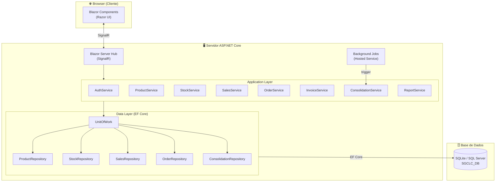
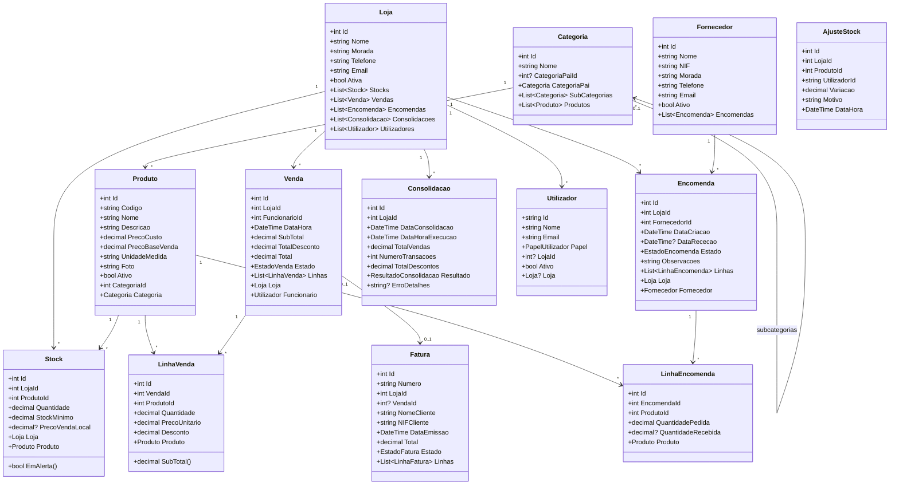
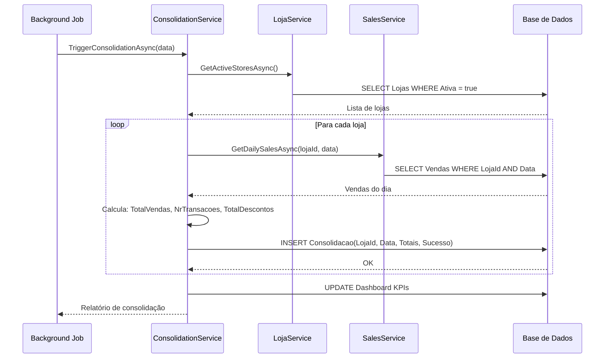
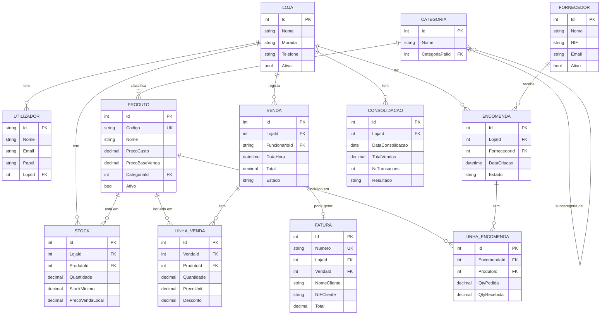

# Arquitetura e Design de Software
## Sistema de Gestão Integrada para uma Cadeia de Lojas de Conveniência

**Versão:** 1.0 | **Data:** 24 de Fevereiro de 2026 | **Projeto:** LI4 2025/2026

---

## 1. Visão Geral da Arquitetura

O SGCLC adota uma **arquitetura em 3 camadas** (Three-Tier Architecture) com separação clara de responsabilidades:

```
┌─────────────────────────────────────┐
│    CAMADA DE APRESENTAÇÃO (UI)      │  ← Blazor Server (Razor Components)
│    Blazor Components + Layouts      │
├─────────────────────────────────────┤
│    CAMADA DE LÓGICA DE NEGÓCIO      │  ← Services, Domain Logic
│    Application Services + Domain    │
├─────────────────────────────────────┤
│    CAMADA DE DADOS                  │  ← EF Core + SQLite/SQL Server
│    Repositories + DbContext         │
└─────────────────────────────────────┘
```

O sistema segue o padrão **Repository + Service Layer**, onde:
- **Repositories** encapsulam o acesso à base de dados
- **Services** implementam a lógica de negócio
- **Blazor Components** consomem os serviços e gerem o estado da UI

---

## 2. Diagrama de Componentes



---

## 3. Diagrama de Classes (Domínio)



---

## 4. Diagrama de Sequência – Registo de Venda

```mermaid
sequenceDiagram
    actor FN as Funcionário
    participant UI as Blazor POS
    participant SS as SalesService
    participant SK as StockService
    participant DB as Base de Dados

    FN->>UI: Pesquisa produto (código/nome)
    UI->>SS: SearchProductsAsync(query)
    SS->>DB: SELECT produtos WHERE search
    DB-->>SS: Lista de produtos
    SS-->>UI: Resultado
    UI-->>FN: Mostra produtos encontrados

    FN->>UI: Adiciona produto ao carrinho (qty)
    UI->>SK: CheckStockAsync(lojaId, produtoId, qty)
    SK->>DB: SELECT Stock WHERE LojaId, ProdutoId
    DB-->>SK: Stock atual
    alt Stock suficiente
        SK-->>UI: OK
        UI-->>FN: Produto adicionado; total atualizado
    else Stock insuficiente
        SK-->>UI: Erro: stock insuficiente
        UI-->>FN: Alerta de stock
    end

    FN->>UI: Confirma venda
    UI->>SS: CreateSaleAsync(lojaId, userId, carrinho)
    SS->>DB: BEGIN TRANSACTION
    SS->>DB: INSERT Venda + LinhaVenda
    SS->>SK: DeductStockAsync(lojaId, linhas)
    SK->>DB: UPDATE Stock SET Quantidade -= qty (por linha)
    DB-->>SK: OK
    SS->>DB: COMMIT TRANSACTION
    DB-->>SS: Venda criada
    SS-->>UI: VendaDTO (id, total, linhas)
    UI-->>FN: Recibo gerado / Venda concluída
```

---

## 5. Diagrama de Sequência – Consolidação Diária



---

## 6. Estrutura do Projeto

```
/ConvenienceChain
├── src/
│   ├── ConvenienceChain.Web/                # Blazor Server App
│   │   ├── Components/
│   │   │   ├── Pages/                       # Páginas Blazor (.razor)
│   │   │   │   ├── Dashboard/
│   │   │   │   ├── POS/
│   │   │   │   ├── Products/
│   │   │   │   ├── Stock/
│   │   │   │   ├── Orders/
│   │   │   │   ├── Invoices/
│   │   │   │   ├── Reports/
│   │   │   │   └── Admin/
│   │   │   └── Shared/                      # Layout, NavMenu, etc.
│   │   ├── wwwroot/                         # CSS, JS, imagens estáticas
│   │   ├── Program.cs
│   │   └── appsettings.json
│   │
│   ├── ConvenienceChain.Core/               # Domínio e Lógica de Negócio
│   │   ├── Entities/                        # Entidades de domínio
│   │   ├── Interfaces/                      # IRepository, IService
│   │   ├── Services/                        # Application Services
│   │   ├── DTOs/                            # Data Transfer Objects
│   │   └── Enums/
│   │
│   └── ConvenienceChain.Data/               # Infraestrutura de Dados
│       ├── Context/                         # AppDbContext (EF Core)
│       ├── Repositories/                    # Implementações de Repository
│       ├── Migrations/
│       └── Seed/                            # Dados iniciais (seed data)
│
├── tests/
│   ├── ConvenienceChain.Tests.Unit/
│   └── ConvenienceChain.Tests.Integration/
│
└── docs/
    ├── etapa1/
    ├── etapa2/
    ├── etapa3/
    └── etapa4/
```

---

## 7. Modelo de Base de Dados (Esquema ER Simplificado)



---

## 8. Decisões de Design

| Decisão | Escolha | Justificação |
|---|---|---|
| Framework | Blazor Server (.NET 8) | Produtividade, estado no servidor, compatível com .NET ecosystem |
| ORM | Entity Framework Core 8 | Code-first, migrations, LINQ queries, suporte a SQLite e SQL Server |
| BD Desenvolvimento | SQLite | Zero configuração, ficheiro local, ideal para desenvolvimento |
| BD Produção | SQL Server / PostgreSQL | Robustez, escalabilidade, suporte a transações concorrentes |
| Autenticação | ASP.NET Core Identity | Integrado, cookie-based, suporte a RBAC nativo |
| Jobs Agendados | .NET Hosted Services (IHostedService) | Integrado no ecossistema, sem dependências externas |
| Padrão de Acesso a Dados | Repository + Unit of Work | Testabilidade, separação de concerns, facilidade de mock em testes |
| Relatórios PDF | QuestPDF | Open-source, fluent API, sem dependência de Office |
