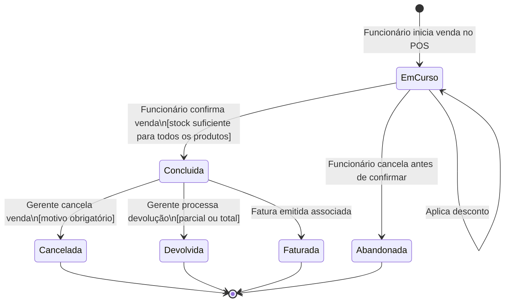
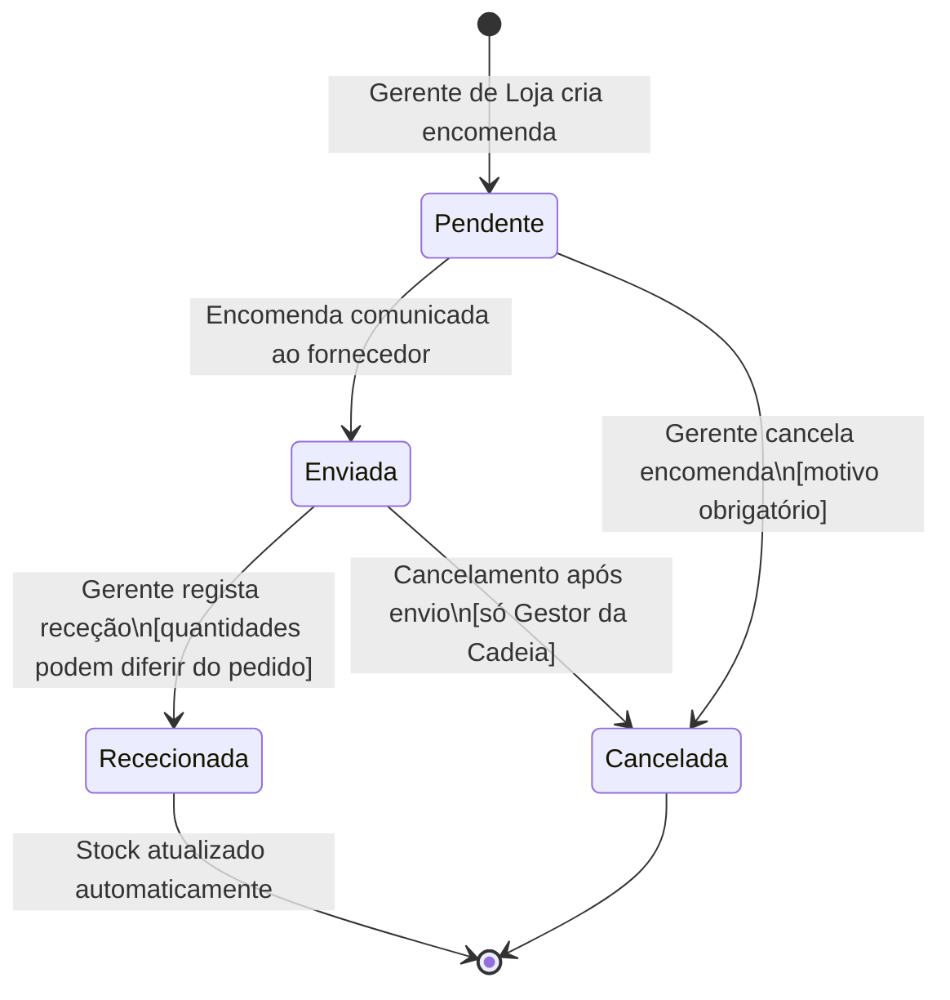
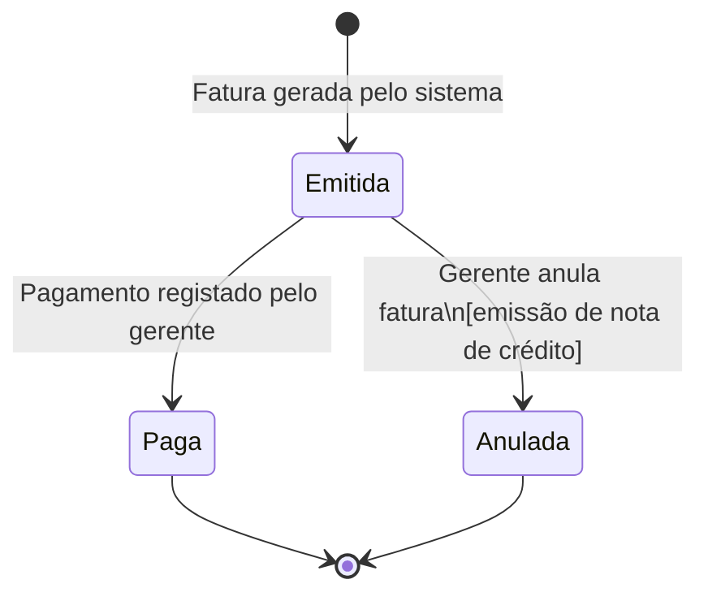
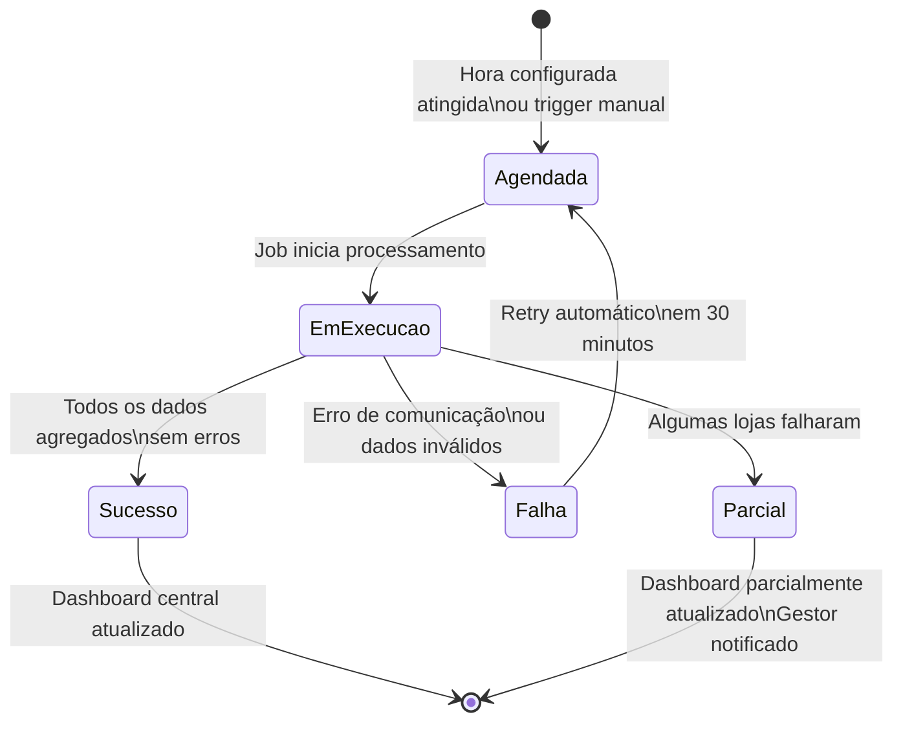
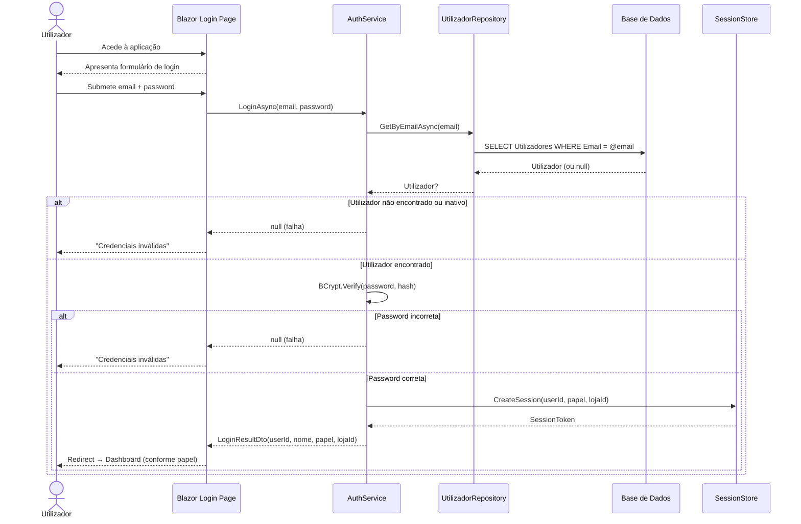
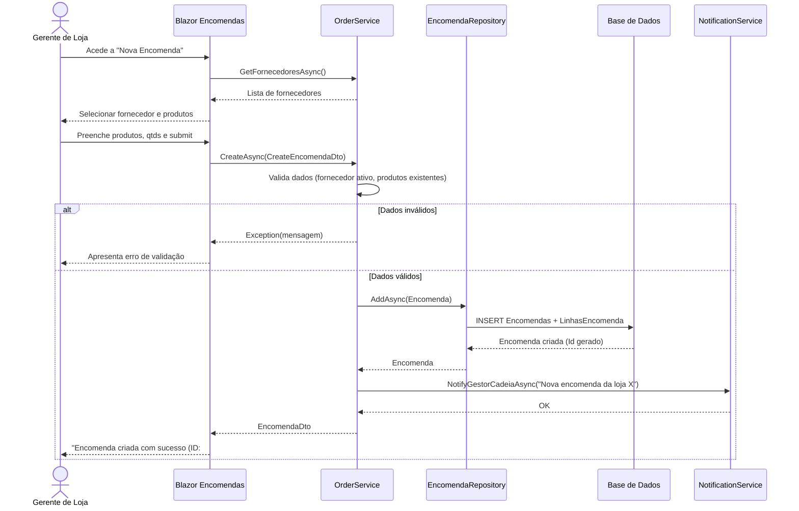
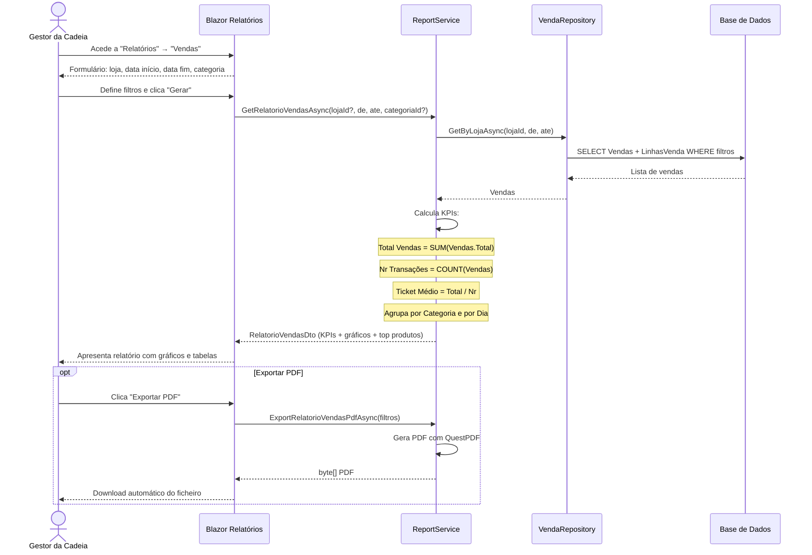
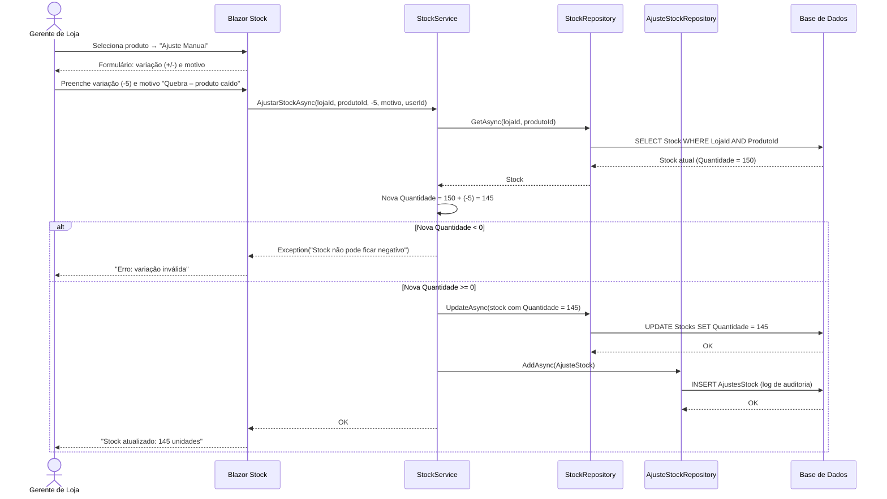

# Diagramas Complementares – Modelação Comportamental
## Sistema de Gestão Integrada para uma Cadeia de Lojas de Conveniência

**Versão:** 1.0 | **Data:** 24 de Fevereiro de 2026 | **Projeto:** LI4 2025/2026

---

## 1. Máquinas de Estado

### 1.1 Máquina de Estados – Venda

---

### 1.2 Máquina de Estados – Encomenda

---

### 1.3 Máquina de Estados – Fatura

---

### 1.4 Máquina de Estados – Consolidação

---

## 2. Diagramas de Sequência Adicionais

### 2.1 Sequência – Login

---

### 2.2 Sequência – Criação de Encomenda

---

### 2.3 Sequência – Geração de Relatório de Vendas

---

### 2.4 Sequência – Ajuste Manual de Stock

