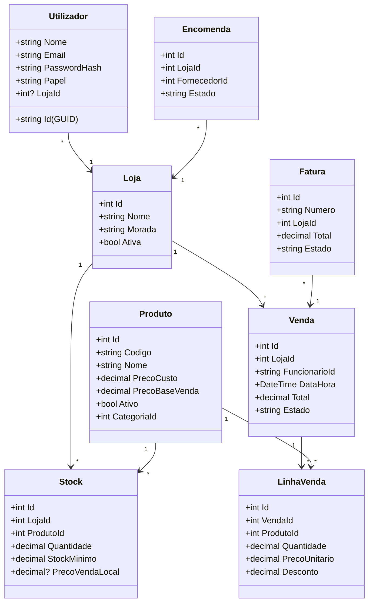

# 4.4 Modelação Estrutural

A modelação estrutural descreve a organização estática do sistema: as entidades de domínio, as suas relações, os casos de uso e a arquitectura de componentes.

## Casos de Uso — Visão Geral

O SGCLC conta com 25 Casos de Uso distribuídos pelos 8 módulos funcionais. O diagrama de casos de uso principal representa as relações entre os três actores e os grupos de funcionalidade:

```mermaid
graph TB
    GC([Gestor da Cadeia])
    GL([Gerente de Loja])
    FN([Funcionário POS])

    subgraph Auth["Autenticação (RF01–RF05)"]
        UC01["UC01: Autenticar"]
        UC02["UC02: Gerir Utilizadores"]
    end

    subgraph Produtos["Catálogo (RF06–RF10)"]
        UC04["UC04: Gerir Produtos"]
        UC05["UC05: Gerir Categorias"]
        UC06["UC06: Pesquisar Produtos"]
    end

    subgraph Stock["Stock (RF11–RF16)"]
        UC07["UC07: Consultar Stock"]
        UC08["UC08: Ajustar Stock"]
        UC09["UC09: Ver Alertas"]
    end

    subgraph POS["POS (RF17–RF22)"]
        UC10["UC10: Registar Venda"]
        UC11["UC11: Aplicar Desconto"]
        UC12["UC12: Emitir Recibo"]
    end

    GC --> UC01
    GC --> UC02
    GC --> UC04 & UC05
    GL --> UC01 & UC07 & UC08 & UC09
    FN --> UC01 & UC10 & UC11 & UC12
```

## Caso de Uso Detalhado — UC10: Registar Venda no POS

| Campo | Detalhe |
|---|---|
| **Actor Principal** | Funcionário de POS |
| **Pré-condições** | Utilizador autenticado com papel Funcionário ou Gerente; loja com pelo menos 1 produto com stock > 0 |
| **Pós-condições** | Venda registada; stock debitado; recibo emitido |
| **Fluxo Principal** | 1. Funcionário acede ao POS → vê tabela de produtos com stock > 0 |
| | 2. Filtra produto por nome/código (client-side, instantâneo) |
| | 3. Adiciona produto ao carrinho (botão "+") |
| | 4. Repete 2–3 para todos os produtos |
| | 5. Opcionalmente, aplica desconto em € |
| | 6. Confirma venda — sistema valida stock |
| | 7. Sistema: debita stock, regista venda, emite recibo |
| **Fluxo Alternativo A** | 6a. Stock insuficiente → sistema apresenta erro; venda não é concluída |
| **Fluxo Alternativo B** | 4b. Funcionário remove produto do carrinho → total recalculado |

## Diagrama de Classes de Domínio (Simplificado)

## Arquitectura de Componentes

O sistema segue o padrão **Repository + Service Layer** com 3 camadas:

| Camada | Componentes Principais | Tecnologia |
|---|---|---|
| Apresentação | Login, Dashboard, POS, Stock, Encomendas, Faturas, Relatórios, Admin | Blazor Server (Razor Components) |
| Lógica de Negócio | AuthService, ProdutoService, StockService, SalesService, OrderService, FaturaService, ConsolidacaoService, ConsolidacaoBackgroundService | C# 12 Classes |
| Dados | ProdutoRepository, StockRepository, VendaRepository, EncomendaRepository, FaturaRepository, UtilizadorRepository, AppDbContext | EF Core 8 |

A injecção de dependências é gerida pelo contentor nativo do ASP.NET Core, com todos os serviços registados em `Program.cs`.
