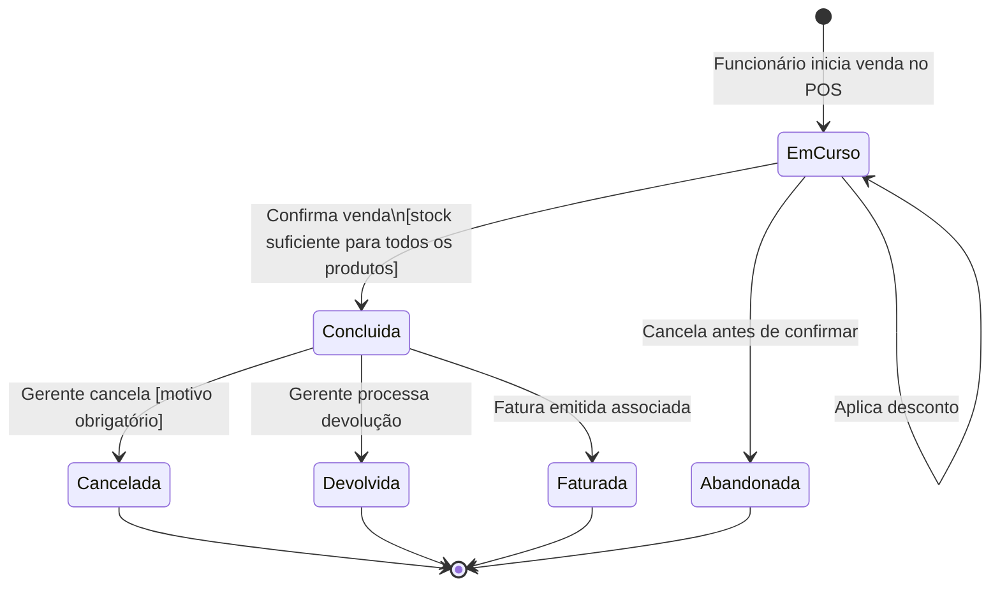
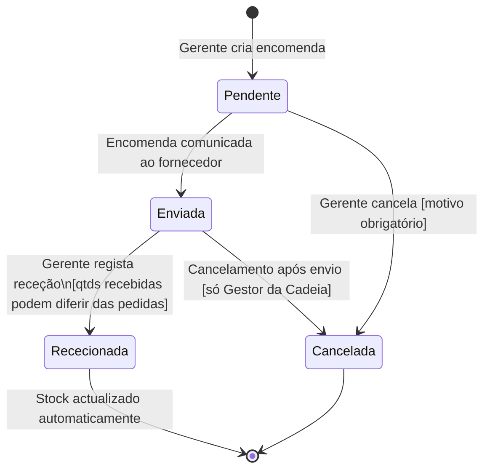
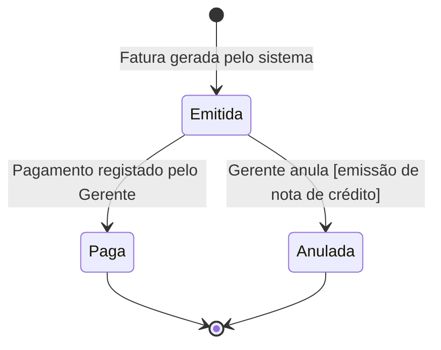
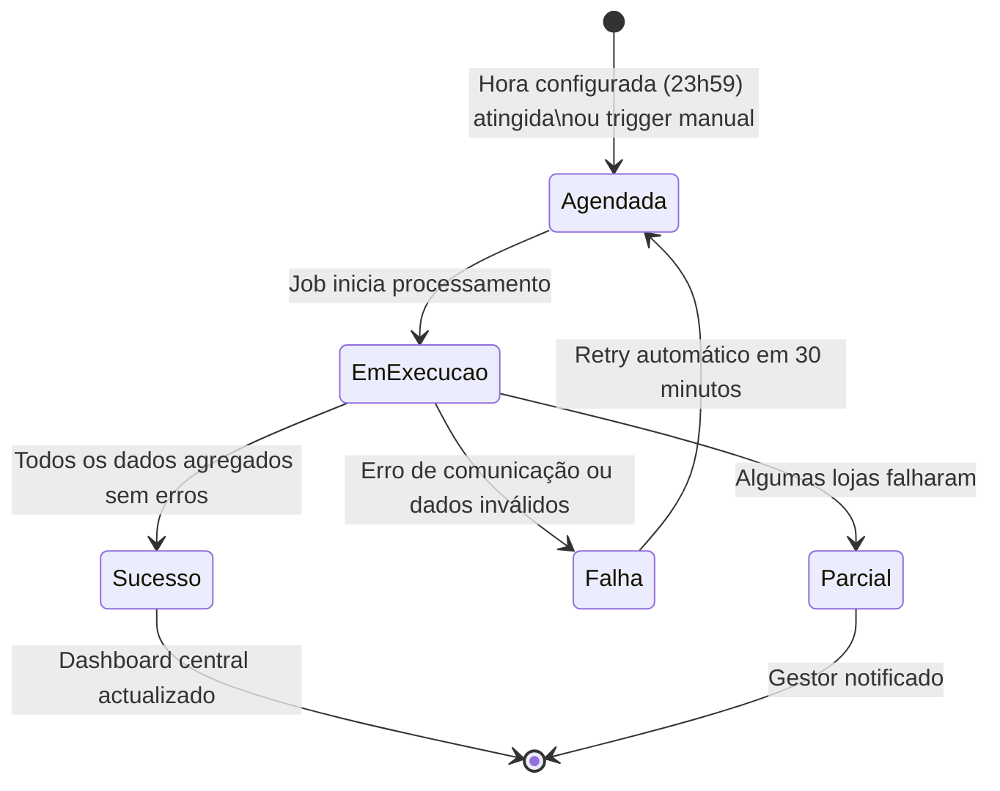

# 4.5 Modelação Comportamental

A modelação comportamental descreve o comportamento dinâmico do sistema ao longo do tempo, modelando os estados possíveis das entidades principais e as transições entre eles. O SGCLC conta com 4 máquinas de estado para as entidades com ciclo de vida bem definido.

## Máquina de Estados — Venda

A entidade `Venda` percorre os seguintes estados desde o momento em que o Funcionário inicia uma venda até à sua resolução final:

**Regras de negócio críticas:**
- Uma venda só transita para `Concluida` se o stock de **todos** os produtos do carrinho for suficiente
- A transição `Concluida → Cancelada` requer motivo obrigatório (campo `MotivoAnulacao`)
- Apenas o Gerente de Loja (ou Gestor da Cadeia) pode cancelar ou devolver uma venda concluída

## Máquina de Estados — Encomenda

**Regra crítica:** Ao transitar para `Rececionada`, o sistema executa automaticamente a actualização de stock com as `QuantidadesRecebidas` (que podem ser inferiores às pedidas — ex.: fornecedor enviou 195 das 200 unidades pedidas).

## Máquina de Estados — Fatura

## Máquina de Estados — Consolidação

**Impacto no design:** A máquina de estados da Consolidação ditou directamente a implementação do `ConsolidacaoBackgroundService` como um `IHostedService` com lógica de retry baseada em `Task.Delay`.
