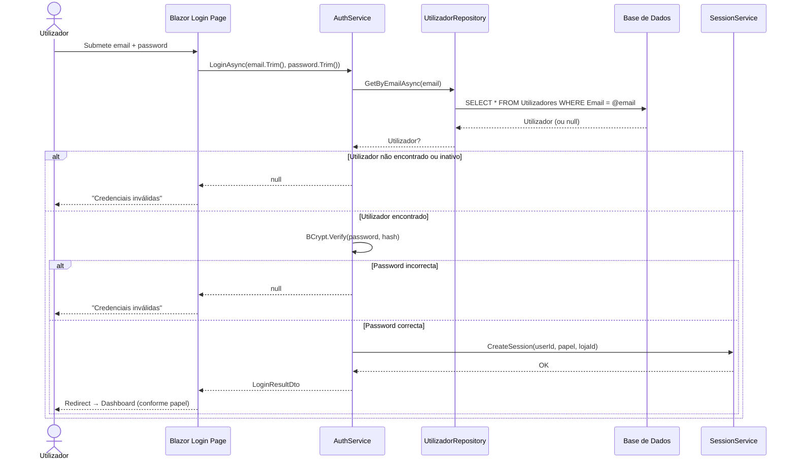
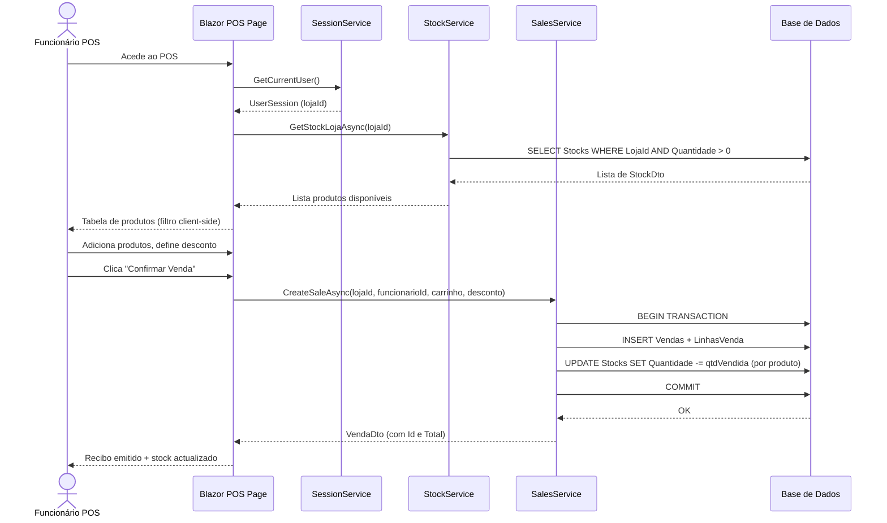
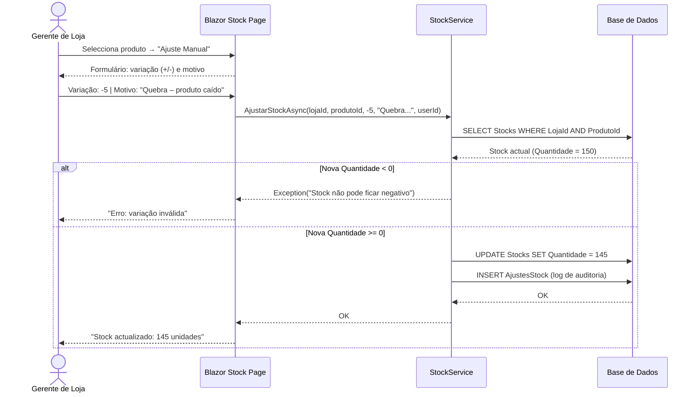
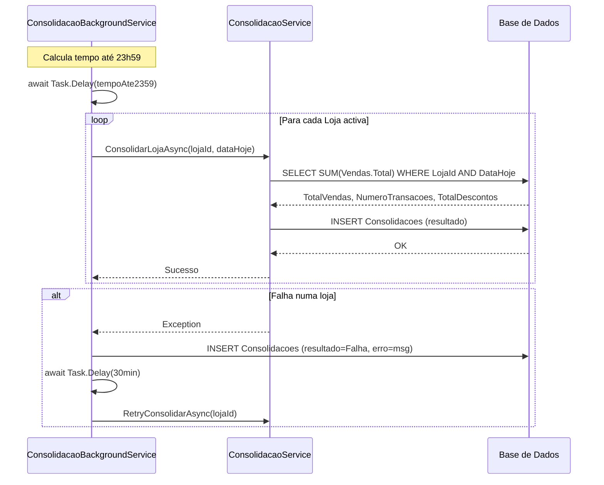

# 4.6 Diagramas de Atividades e Sequência

Os diagramas de sequência complementam as máquinas de estado ao descrever a interacção temporal entre os diferentes componentes do sistema durante a execução de um fluxo específico. São apresentados os diagramas de sequência para os quatro fluxos mais críticos do SGCLC.

## Diagrama de Sequência — Login e Autenticação

**Decisões de design reveladas:** O trimming de email e password antes de chamar `LoginAsync` é da responsabilidade da UI (Login.razor), não do serviço — decisão que mantém o serviço genérico. O `SessionService` é um singleton que mantém o estado de sessão em memória (adequado para Blazor Server).

## Diagrama de Sequência — Registo de Venda no POS

## Diagrama de Sequência — Ajuste Manual de Stock

## Diagrama de Sequência — Consolidação Automática

