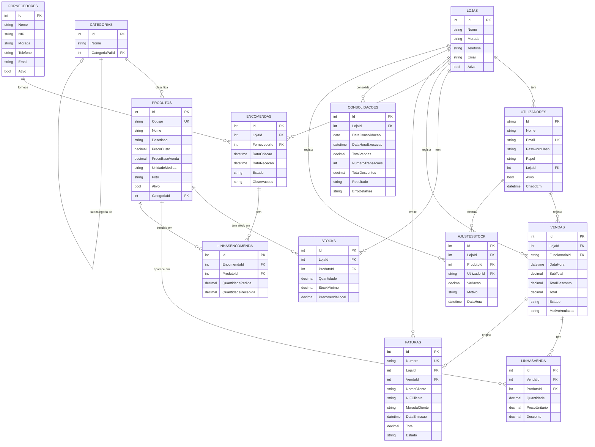

# 5.2 Modelo Entidade-Relacionamento

O Modelo Entidade-Relacionamento (MER) do SGCLC representa as entidades do domínio, os seus atributos e as relações entre elas. O diagrama abaixo foi elaborado na fase de design (Etapa 2) e serviu como base directa para o esquema físico da base de dados.

## Restrições de Unicidade Relevantes

As seguintes restrições de unicidade são críticas para a consistência do modelo:

| Tabela | Restrição UK | Significado de Negócio |
|---|---|---|
| `Utilizadores` | `(Email)` | Um endereço de e-mail só pode corresponder a uma conta |
| `Produtos` | `(Codigo)` | Cada produto tem um código de barras ou código interno único |
| `Stocks` | `(LojaId, ProdutoId)` | Um produto aparece no máximo uma vez por loja |
| `Faturas` | `(Numero)` | A numeração de faturas é globalmente única |
| `Consolidacoes` | `(LojaId, DataConsolidacao)` | Só existe uma consolidação por loja por dia |
